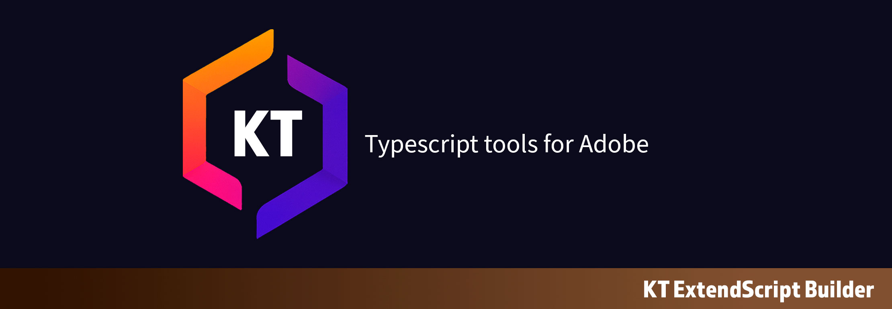

# KT ExtendScript Builder

KT ExtendScript Builder is a specialized tool designed to simplify the process of transpiling TypeScript code to ExtendScript for Adobe Creative Cloud applications. Built on Vite, it provides a streamlined workflow for developing, building, and testing ExtendScript code.

## Quick Start

### Installation

```bash
npm install kt-extendscript-builder --save-dev
```

### Basic Usage

```bash
# Build your project
npx kt-build

# Development mode with watch
npx kt-build --mode development --watch

# Build tests
npx kt-build --test
```

## Configuration

Configure your builds using command-line options or a `kt-config.json` file in your project root. Define multiple build profiles for different environments (development, production, testing) with custom settings for input/output paths, Adobe app targeting, and ponyfills.

**Example `kt-config.json`:**

```json
{
  "default": {
    "input": "src/index.ts",
    "output": "dist/index.js",
    "mode": "production"
  },
  "dev": {
    "mode": "development",
    "watch": true
  }
}
```

## Usage

Use KT ExtendScript Builder via command-line interface, integrate it into your npm scripts, or call it programmatically in Node.js scripts. Supports watch mode for development and test-specific builds.

**Example npm scripts in `package.json`:**

```json
{
  "scripts": {
    "build": "kt-build",
    "dev": "kt-build dev",
    "test": "kt-build --test"
  }
}
```

## Documentation

- [Installation](docs/installation.md) - Detailed installation instructions
- [Configuration](docs/configuration.md) - Command-line options and configuration files
- [Usage](docs/usage.md) - CLI usage, npm scripts integration, and programmatic API
- [Advanced Features](docs/advanced-features.md) - Custom ponyfills, Adobe targeting, and testing
- [Examples](docs/examples.md) - Code examples and use cases

## Features

- TypeScript to ExtendScript transpilation
- ES3 target support for maximum compatibility with Adobe apps
- Development and production build modes
- Watch mode for real-time development
- Command-line interface for easy integration into workflows
- Custom ponyfills support for extending ExtendScript compatibility
- Adobe application type definitions integration
- Test-specific configuration support

## Links

- [KT Testing Suite Core](https://github.com/Octopodo/kt-testing-suite-core)
- [KT Testing Suite AE](https://github.com/Octopodo/kt-testing-suite-ae)
- [Bolt CEP](https://github.com/hyperbrew/bolt-cep)
- [After Effects Scripting Guide](https://ae-scripting.docsforadobe.dev/)
- [Types for Adobe](https://github.com/docsforadobe/Types-for-Adobe)

## License

MIT
